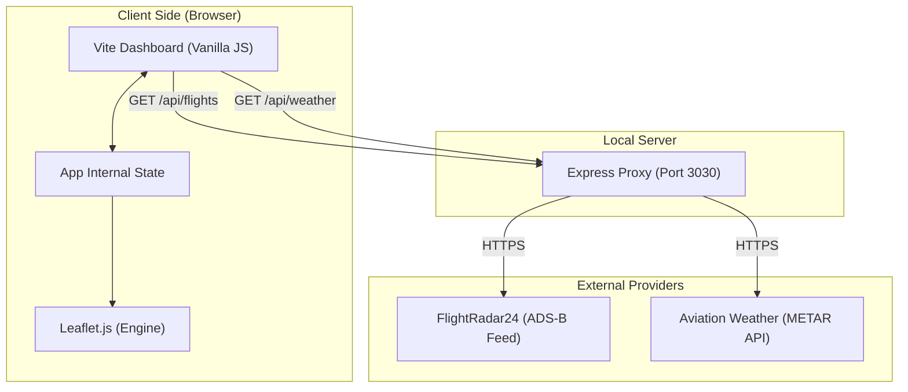

# 🇫🇮 Suomi Radar: Finland Live Flight Tracker

[](https://vitejs.dev/)
[](https://nodejs.org/)
[](https://leafletjs.com/)
[](https://opensource.org/licenses/MIT)

**Suomi Radar** is a high-performance, real-time aviation dashboard dedicated to tracking aircraft within Finnish airspace. It merges live ADS-B data from FlightRadar24 with professional aviation weather (METAR) to provide a premium monitoring experience.

---

## 📸 Dashboard Preview


*Live view of the glassmorphic dashboard tracking flights over Helsinki and Tampere.*

---

## ✨ Key Features

### 📡 Real-Time ADS-B Tracking
*   **Live Data Feed:** Fetches coordinates, altitude, Heading, and speed for all active aircraft in the Finland zone.
*   **Smooth Interpolation:** Uses high-frequency frame animation to predict and animate aircraft movement between data updates.
*   **Interactive Markers:** Click any aircraft to pull up a technical detail panel.

### 🌡️ Aviation Weather (METAR)
*   **Live Airport Hubs:** Fetch real-time weather reports for:
    *   **EFHK** (Helsinki-Vantaa)
    *   **EFOU** (Oulu)
    *   **EFTP** (Tampere-Pirkkala)
*   **Technical Metrics:** Displays temperature, wind direction/speed, and visibility distance.

### 🎨 Premium Glassmorphic UI
*   **Dark Mode Optimization:** A sleek, midnight-blue interface designed for technical precision and night viewing.
*   **Interactive Sidebar:** Real-time stats on flights currently in the air.
*   **Airport Boards:** Simulated arrivals and departures for the selected major hub.

---

## 🏗️ Technical Architecture

The application is built on a modern decoupled architecture to bypass browser security constraints (CORS) and ensure high data reliability.



---

## 🚀 Getting Started

To launch your own instance of Suomi Radar, follow these steps:

### 1. Prerequisites
Ensure you have [Node.js](https://nodejs.org/) installed on your system.

### 2. Installation
Clone the repository and install dependencies:
```bash
npm install
```

### 3. Execution
The app requires two concurrent processes:

**Terminal 1 (Vite Dev Server):**
```bash
npm run dev
```
*Access via [http://localhost:5173](http://localhost:5173)*

**Terminal 2 (Radar Proxy):**
```bash
node proxy.js
```
*Required for live data sync.*

---

## 📂 Project Structure

```text
├── src/
│   ├── main.js        # Core logic, map handling, & API polling
│   └── style.css      # CSS system (Glassmorphism, Animations)
├── index.html         # Application viewport structure
├── proxy.js           # Node.js backend to bypass CORS
├── package.json       # Project dependencies & scripts
└── README.md          # Technical documentation
```

---

## 🛠️ Built With
*   [Leaflet.js](https://leafletjs.com/) - Mobile-friendly interactive maps
*   [Vite](https://vitejs.dev/) - Next-generation frontend tooling
*   [Express](https://expressjs.com/) - Fast, unopinionated web framework for Node.js
*   [Axios](https://axios-http.com/) - Promise-based HTTP client

---
*Created as part of the AI in Practice course. 🇫🇮*
